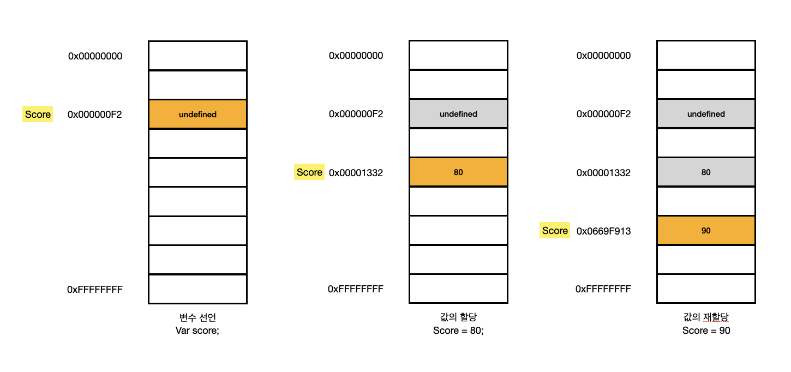
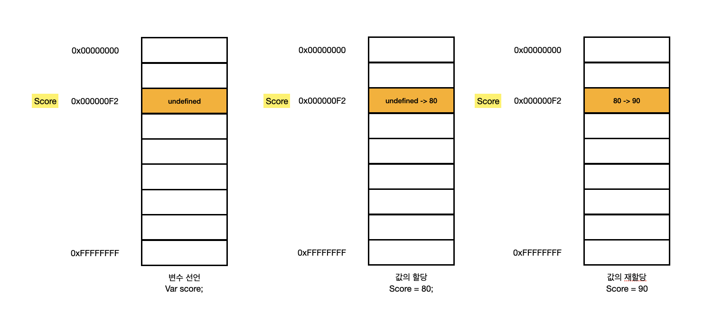

# 출처 DeepDive

## 원시 값과 객체의 비교

### 11.1 원시 값

원시 타입의 값, 즉 원시 값은 변경 불가능한 값이다. 다시 말해, 한번 생성된 원시 값은 읽기 전용값으로서 변경할 수 없다.

원시 값을 할당한 변수에 새로운 원시 값을 재할당하면 메모리 공간에 저장되어 있는 재할당 이전의 원시 값을 변경하는 것이 아니라 새로운 메모리 공가을 확보하고 재할당한 원시 값을 저장한 후, 변수는 새롭게 재할당한 원시 값을 가리킨다. 이때 변수가 참조하던 메모리 공간의 주소가 바뀐다.

변수가 참조하던 메모리 공간의 주소가 변경된 이유는 변수에 할당된 원시 값이 변경 불가능한 값이기 때문이다. 만약 원기 값이 변경 가능한 값이라면 변수에 새로운 원시 값을 재할당했을 때 변수가 가리키던 메모리 공간의 주소를 바꿀 필요없이 원시 값 자체를 변경하면 그만이다. 만약 그렇다면 변수가 참조하던 메모리 공간의 주소는 바뀌지 않는다.

하지만 원시 값은 변경 불가능한 값이 때문에 값을 직접 변경할 수 없다. 따라서 변수 값을 변경하기 위해 원시 값을 재할당하면 새로운 메모리 공간을 확보하고 재할당한 값을 저장한 후, 변수가 참조하던 메모리 공간의 주소를 변경한다. 값의 이러한 특성을 불변성(immutability)이라 한다.
