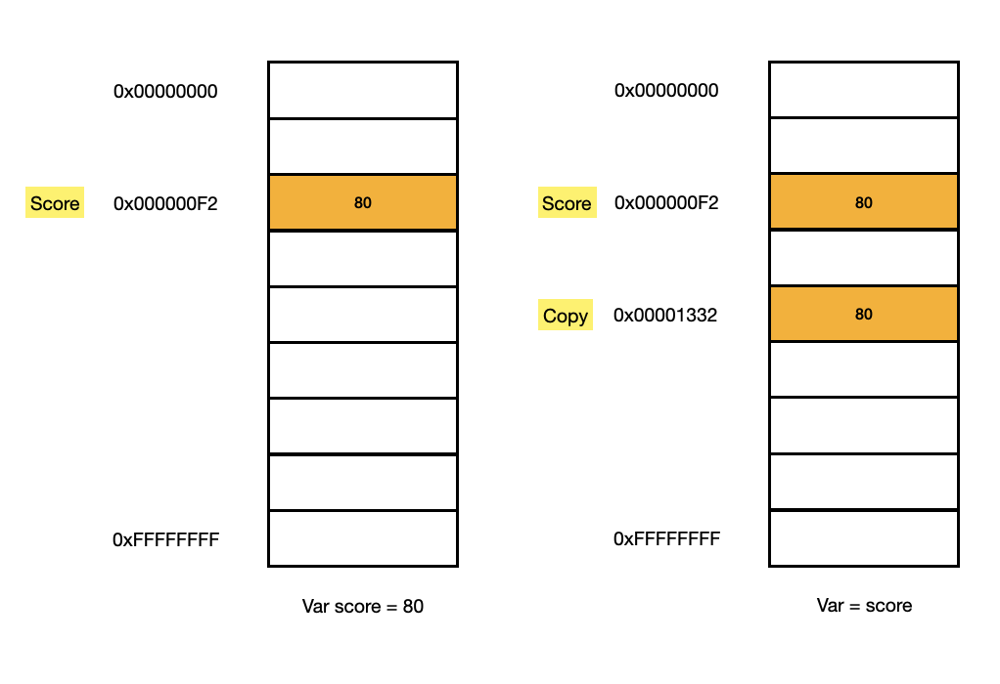
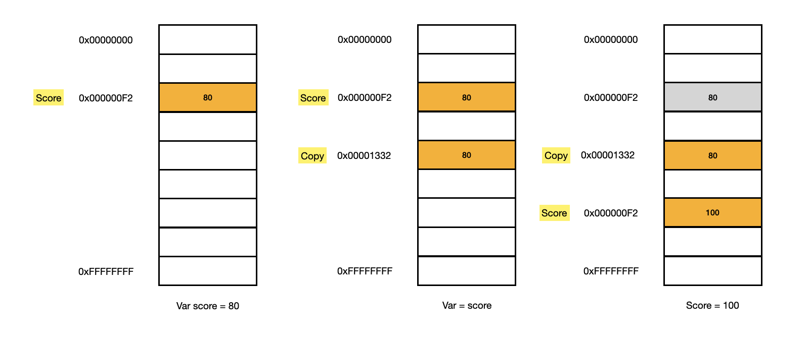

# 출처 DeepDive

## 원시 값과 객체의 비교

### 11.1 원시 값

원시 타입의 값, 즉 원시 값은 변경 불가능한 값이다. 다시 말해, 한번 생성된 원시 값은 읽기 전용값으로서 변경할 수 없다.

원시 값을 할당한 변수에 새로운 원시 값을 재할당하면 메모리 공간에 저장되어 있는 재할당 이전의 원시 값을 변경하는 것이 아니라 새로운 메모리 공가을 확보하고 재할당한 원시 값을 저장한 후, 변수는 새롭게 재할당한 원시 값을 가리킨다. 이때 변수가 참조하던 메모리 공간의 주소가 바뀐다.


변수가 참조하던 메모리 공간의 주소가 변경된 이유는 변수에 할당된 원시 값이 변경 불가능한 값이기 때문이다. 만약 원기 값이 변경 가능한 값이라면 변수에 새로운 원시 값을 재할당했을 때 변수가 가리키던 메모리 공간의 주소를 바꿀 필요없이 원시 값 자체를 변경하면 그만이다. 만약 그렇다면 변수가 참조하던 메모리 공간의 주소는 바뀌지 않는다.


하지만 원시 값은 변경 불가능한 값이 때문에 값을 직접 변경할 수 없다. 따라서 변수 값을 변경하기 위해 원시 값을 재할당하면 새로운 메모리 공간을 확보하고 재할당한 값을 저장한 후, 변수가 참조하던 메모리 공간의 주소를 변경한다. 값의 이러한 특성을 불변성(immutability)이라 한다.

불변성을 갖는 원시 값을 할당한 변수는 재할당 이외에 변수 값을 변경할 수 있는 방법이 없다.
만약 이외에 원시 값인 변수 값을 변경할 수 있다면 예기치 않게 변수 값이 변경될 수 있다는 것을 의미한다.
이는 값의 변경, 즉 상태 변경를 추적하기 어렵게 만든다.

## 11.2 문자열과 불변성

앞서 봤듯이 원시 값을 저장 하려면 먼저 확보해야 하는 메모리의 공간의 크기를 결정해야 한다.
이를 위해 원시 타입별로 메모리 공간의 크기가 미리 정해저 있다고 했다. 단 ECMAScript 사양에 따라 문자열 타입(2byte)과 숫자 타입(8byte) 이외의 원시 타입을 크기를 명확히 규정하고 있지는 않아서 브라우저 제조사의 구현에 따라 원시 타입의 크기를 다를 수 있다.

```js
var str1 = ""; // 0개의 문자로 이뤄진 문자열
var str2 = "Hello"; // 5개의 문자로 이뤄진 문자열
```

```js
var str = "Hello";
str = "world";
```

첫 번째 문이 실행되문 문자열 'Hello'가 생성되고 식별자 str은 문자열 'Hello'가 저장된 메모리 공간의 첫 번째 메모리 셀 주소를 가리킨다.
그리고 두 번째 문이 실행되면 이전에 생성된 문자열 'Hello'를 수정 하는 것이 아니라 새로운 문자열 'world'를 메모리에 생성하고 식별자 str은 이것을 가리킨다. 아때 문자열 'Hello'와 'world'는 모두 메모리에 존재한다. 식별자 str은 문자열 'Hello'를 가리키고 있다가 문자열 'world'를 가리키도록 변경되었을 뿐이다.

### 유사 배열 객체 array-like object

유사 배열 객체란 마치 배열처럼 인덱스로 프로퍼티 값에 접근할 수 있고 length 프로퍼티를 갖는 객체를 말한다. 물자열은 마치 배열처럼 인덱스를 통해 각 문자에 접근할 수 있으며, length 프로퍼티를 갖기 때문에 유사 배열 객체이고 for 문으로 순회할 수 있다.

```js
let str = "string";

// 문자열은 유사 배열이므로 배열과 유사하게 인덱스를 사용해 각 문자에 접근 할 수 있다.
console.log(str[0]); // s

// 원시 값인 문자열이 객체처럼 동작한다.
console.log(str.length); // 6
console.log(str.toUpperCase()); // STRING
```

```js
var str = "string";

// 문자열은 유사 배열이므로 배열과 유사하게 인덱스를 사용해 각 문자에 접근할 수 있다.
// 하지만 문자열은 원시 값이므로 변경할 수 없다. 이때 에러가 발생하지 않는다.
str[0] = "S";

console.log(str); // string
```

이처럼 이미 생성된 문자열의 일부 문자를 변경해도 반영되지 않는다. 문자열은 변경 불가능한 값이기 때문이다. 이처럼 한번 생성된 문자열은 읽기 전용 값으로서 변경할 수 없다. 원시 값은 어떤 일이 있어도 불변한다. 이는 데이터의 신뢰성을 보장한다.

## 11.3 값에 의한 전달

```js
var score = 80;
var copy = score;

console.log(score); // 80
console.log(copy); // 80

score = 100;

console.log(score); // 100
console.log(copy); // 80?
```

score 변수에 숫자 값 80을 할당했다. 그리고 copy 변수에 score 변수를 할당했다. 그 후, score 변수에 새로운 숫자 값 100을 재할당하면 copy 변수의 값은 될까?

이 질문의 핵심은 변수에 변수를 할당했을 때 무엇이 어떻게 전달되는가다. copy = score에서 score는 변수 값 80으로 평가되므로 copy 변수에도 80이 할당 될 것이다. 이때 새로운 숫자 80이 생성되어 copy 변수에 할당된다.

이처럼 변수에 원시 값을 갖는 변수를 할당하면 할당받는변수에는 할당되는 변수의 원시값이 복사되어 전달된다. 이를 값에 의한 전달이라 한다.

```js
var score = 80;

// copy 변수에는 score 변수의 값 80이 복사되어 할당된다.
var copy = score;

console.log(score, copy); // 80 80
console.log(score === copy); // true
```

이때 score 변수와 copy 변수는 숫자 값 80을 갖는다는 점에서는 동일하다.
그렇지만 score 변수와 copy 변수의 값 80은 다른 메모리 공간에 저장된 별개의 값이다.



이제 score 변수의 값을 변경해 보자

```js
var score = 80;
var copy = score;

console.log(score, copy); // 80 80
console.log(score === copy); // true

score = 100;

console.log(score, copy); // 100 80
console.log(score === copy); // false
```



사실 위 그림은 실제 자바스크립트 엔진의 내부 동작과 정확히 일치하지 않을 수 있다. ECMAScript 사양에는 변수를 통해 메모리를 어떻게 관리해야 하는지 명확하게 정의되어 있지 않다.

위 그림에서는 변수에 원시 값을 갖는 변수를 할당하면 원시 값이 복사되는 것으로 표현했다. 하지만 변수에 원시 값을 갖는 변수를 할당하는 시점에는 같은 원시 값을 참조하다가 어느 한쪽이 변수에 재할당이 이뤄졌을 때 비로소 새로운 메모리 공간에 재할당된 값을 저정하도록 동작할 수도 있다. 파이썬은 이처럼 동작한다.

또한 '값에 의한 전달'이라는 용어도 ECMAScript 사양에서는 등장하지 않는다. 이 책에서는 타 언어에서 자주 사용하는 '값에 의한 전달'과 '참조에 의한 전달'이라는 용어를 사용하지만 '공유에 의한 전달(pass by sharing)'이라고 표현하는 경우도 있다.

엄격하게 표현하면 변수에는 값이 전달되는 것이 아니라 메모리 주소가 전달되기 때문이다. 이는 변수와 같은 식별자는 값이 아니라 메모리 주소를 기억하고 있기 때문이다.
